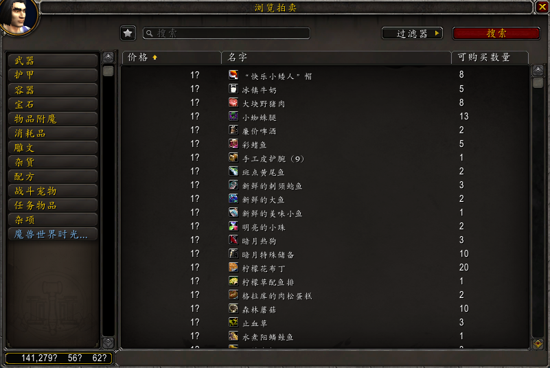
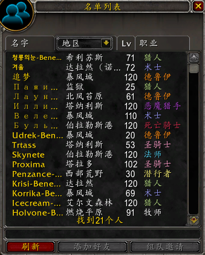
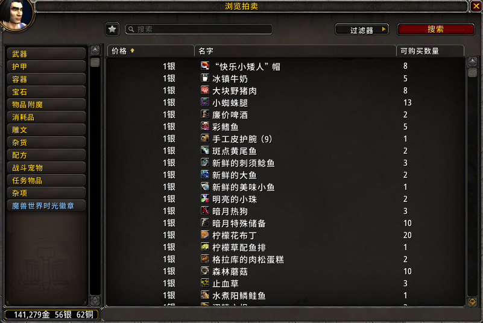
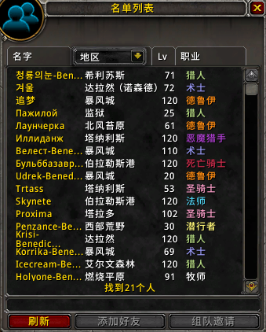

# Global Font (Template)

Unified font for all supported languages.

## Compatibility

| Category | Compatible? |
| -------- | ----------- |
| WoW’s default UI | ✔ |
| Addons that use standard fonts | ✔ |
| Addons that use built-in font objects | ✔ |
| Addons that use LibSharedMedia’s font storage | ✔ * |
| Addons that have hard-coded font | ✘ |

* Need configuration — select “Global Font - Default” or “Global Font - Chat”.

## Customisation

This section describes how to create an addon with your favorite font.

We take “Global Font (Std W4)” for example in this section.

### Character set recommendation

| Character set  | PTR | NA | EU | CN | TW | KR | Global |
| -------------- | --- | -- | -- | -- | -- | -- | ------ |
| Basic Latin    | x   | x  | x  | x  | x  | x  | x      |
| Extended Latin | x   | x  | x  | x  | x  | x  | x      |
| Cyrillic       | x   | o  | x  | o  | o  | o  | x      |
| CJK ideograph  | x   | o  |    | x  | x  | o¹ | x      |
| CJK extended   |     |    |    | o  | o  |    | o      |
| Hangul         | x   | o  |    |    | o¹ | x  | x      |

0. x for required; o for recommended.
1. TW and KR share the same Battle.net region where Btag friends may have their names in CJK ideograph or Hangul.

Global Font’s Std editions cover basic Latin, extended Latin, Cyrillic, CJK ideograph and Hangul; Pro editions cover all above.

### Addon name

Rename `!GlobalFont_Template` (directory) and `!GlobalFont_Template.toc`.

e.g.
```
!GlobalFont_StdW4 ─┬─ !GlobalFont_StdW4.toc
                   └─ ...
```

In your renamed toc file, modify `Title` and other information.

e.g. in `!GlobalFont_StdW4.toc`,
```
## Title: Global Font (Std W4)
```

In `FixedSize.xml`, modify edition ID:
```xml
<!DOCTYPE Ui [
    <!ENTITY EditionId "Template">
    ...
]>
```

e.g.
```xml
<!DOCTYPE Ui [
    <!ENTITY EditionId "StdW4">
    ...
]>
```

### Font files

In `Core.lua`, modify these lines:
```lua
GlobalFont.DefaultFont = [[Interface\AddOns\!GlobalFont_Template\SampleFont.ttf]]
GlobalFont.ChatFont = [[Interface\AddOns\!GlobalFont_Template\SampleChat.ttf]]
```

e.g.
```lua
if GlobalFont.Locale == "zhCN" then
    GlobalFont.DefaultFont = [[Interface\AddOns\!GlobalFont_StdW4\WarSans-CN-Medium.otf]]
    GlobalFont.ChatFont = [[Interface\AddOns\!GlobalFont_StdW4\WarSans-CN-CondensedMedium.otf]]
elseif GlobalFont.Locale == "zhTW" then
    GlobalFont.DefaultFont = [[Interface\AddOns\!GlobalFont_StdW4\WarSans-TW-Medium.otf]]
    GlobalFont.ChatFont = [[Interface\AddOns\!GlobalFont_StdW4\WarSans-TW-CondensedMedium.otf]]
else
    -- enUS, esMX, ptBR, deDE, esES, frFR, itIT, ruRU, koKR
    GlobalFont.DefaultFont = [[Interface\AddOns\!GlobalFont_StdW4\WarUI-CL-ExtendedMedium.otf]]
    GlobalFont.ChatFont = [[Interface\AddOns\!GlobalFont_StdW4\WarUI-CL-CondensedMedium.otf]]
end
```

In `FixedSize.xml`, modify these lines:
```xml
<!DOCTYPE Ui [
    ...
    <!ENTITY DefaultFont_Western "Interface\AddOns\!GlobalFont_Template\SampleFont.ttf">
    <!ENTITY DefaultFont_zhCN "Interface\AddOns\!GlobalFont_Template\SampleFont.ttf">
    <!ENTITY DefaultFont_zhTW "Interface\AddOns\!GlobalFont_Template\SampleFont.ttf">
]>
```

e.g.
```xml
<!DOCTYPE Ui [
    ...
    <!ENTITY DefaultFont_Western "Interface\AddOns\!GlobalFont_StdW4\WarUI-CL-ExtendedMedium.otf">
    <!ENTITY DefaultFont_zhCN "Interface\AddOns\!GlobalFont_StdW4\WarSans-CN-Medium.otf">
    <!ENTITY DefaultFont_zhTW "Interface\AddOns\!GlobalFont_StdW4\WarSans-TW-Medium.otf">
]>
```

### Font size determination

> **Background**: Chinese characters are often much more complex than Latin, Cyrillic letters, and even Hangul syllables (comparison: 织梦者 / 織夢者 vs. Dreamweavers / Ткачи Снов / 몽술사). Thus font size in Chinese should be larger than other languages.
>
> Ideally, we can follow WoW’s default font size in Chinese. But, that’s not good.
>
> The most terrible one is the item list in new auction house frame.
> ```xml
> <FontFamily name="NumberFont_Normal_Med" virtual="true">
>     <Member alphabet="roman">
>         <Font font="Fonts\ARIALN.TTF" height="14"/>
>     </Member>
>     <Member alphabet="simplifiedchinese">
>         <!-- 12px handwriting font? -->
>         <Font font="Fonts\ARKai_C.ttf" height="12"/>
>     </Member>
>     ...
> </FontFamily>
> ```
>
> 
>
> And there is something unpleasant about player level in who list frame.
> ```xml
> <FontFamily name="SystemFont_Shadow_Small" virtual="true">
>     <Member alphabet="roman">
>         <Font font="Fonts\FRIZQT__.TTF" height="10">
>             <Shadow .../>
>         </Font>
>     </Member>
>     <Member alphabet="simplifiedchinese">
>         <!-- oops! 15px is toooooo laaarge. -->
>         <Font font="Fonts\ARKai_T.ttf" height="15">
>             <Shadow .../>
>         </Font>
>     </Member>
>     ...
> </FontFamily>
> ```
>
> 
>
> As a workaround, Global Font introduced a function `GlobalFont.CalculateFontSize` to determine font size. This function takes 2 parameters, `sizeWestern` – WoW’s default font size in English (and other European languages), `sizeChinese` – WoW’s default font size in Simplified Chinese, and returns the calculated font size.

In `Core.lua`, modify `GlobalFont.CalculateFontSize` function.
```lua
function GlobalFont.CalculateFontSize(sizeWestern, sizeChinese)
    -- write your font size determining logic here
end
```

e.g.
```lua
function GlobalFont.CalculateFontSize(sizeWestern, sizeChinese)
    if GlobalFont.Locale == "zhCN" or GlobalFont.Locale == "zhTW" then
        if sizeWestern >= sizeChinese then
            return sizeWestern
        else
            -- root-mean-square (RMS)
            return ((sizeWestern ^ 2 + sizeChinese ^ 2) / 2) ^ 0.5
        end
    else
        return sizeWestern
    end
end
```

With 14px sans serif font, the item list in new auction house frame is much better.



And who list looks more balanced.


